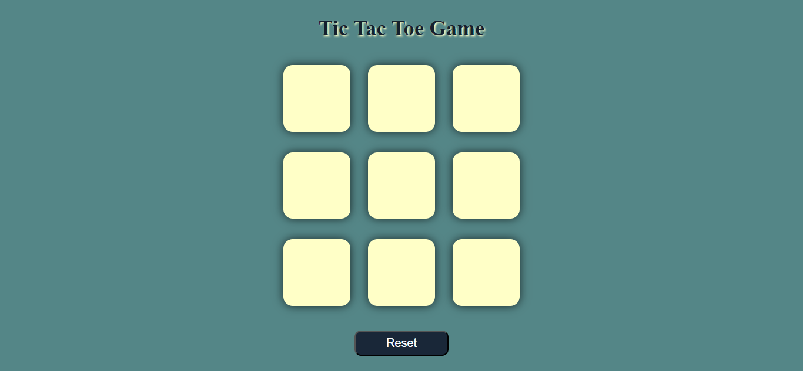
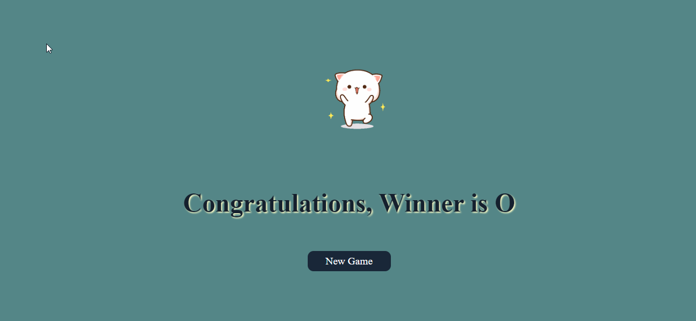
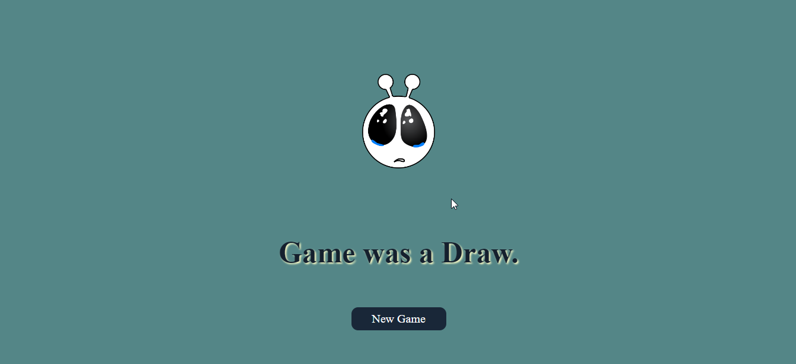

# Tic Tac Toe Game ...❌⭕

This is a simple Tic Tac Toe game built using HTML, CSS, and JavaScript.

The game allows two players to take turns and play against each other. 
The winner is determined when one player gets three of their symbols (either “X” or “O”) in a row, column, or diagonal.
If all cells are filled and no winner is determined, the game ends in a draw.

## Technologies Used
* HTML
* CSS
* JavaScript

## Screenshots

## Deployment
Game live at [tic-tac-toe](https://kapadiya-gaurav.github.io/tic-tac-toe-game/).

